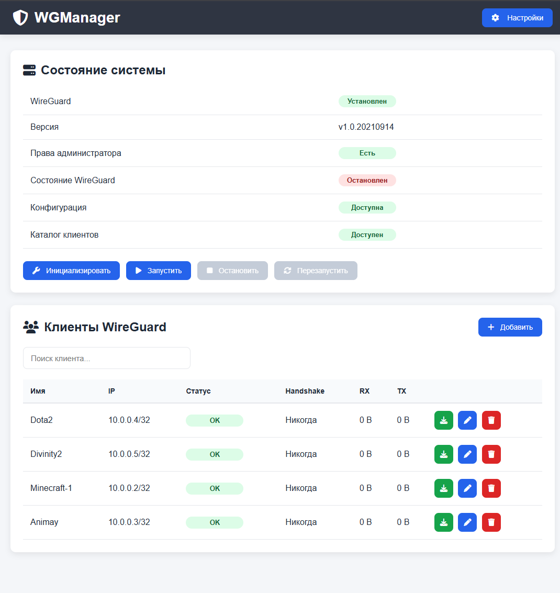

# WGManager



A modern web interface for managing WireGuard servers


Simple • Fast • Lightweight • No Docker Required

## 📑 Table of Contents

- [Features](#-features)
- [Screenshots](#-screenshots)
- [Requirements](#requirements)
- [Installation](#installation)
- [Permissions](#permissions)
- [API Authentication](#api-authentication)
- [CLI](#cli)
- [REST API](#rest-api)
- [Roadmap](#roadmap)
- [Contributing](#contributing)
- [License](#license)

## ✨ Features

- Modern Web UI
- API Key authentication
- WireGuard initialization and management
- Create, edit and delete clients
- Download client configuration
- Automatic WireGuard key generation
- Start / Stop / Restart WireGuard
- Real-time server status
- Automatic client directory management
- No Docker required

## 📸 Screenshots


## Requirements

- Ubuntu 22.04+
- PHP 8.2+
- Nginx
- WireGuard
- sudo

### Required PHP extensions

- mbstring
- json
- curl
- zip
- opcache

## Installation

```bash
git clone https://github.com/VadimContentHunter/WGManager.git

cd WGManager

chmod +x install.sh
sudo ./install.sh
```

Configure Nginx and restart the service.

## Permissions

The web server requires access to:

- `/etc/wireguard`
- `config/settings.json`
- Client directory

Example sudoers configuration:

```text
www-data ALL=(ALL) NOPASSWD: /usr/bin/wg
www-data ALL=(ALL) NOPASSWD: /usr/bin/wg-quick
```

## API Authentication

Every request must include the following header:

```http
X-API-Key: YOUR_API_KEY
```

## CLI

Generate API key:

```bash
php console.php apikey generate
```

Rotate API key:

```bash
php console.php apikey rotate
```

Delete API key:

```bash
php console.php apikey clear
```

## REST API

| Method | Endpoint |
| :----- | :------- |
| GET | `/api/setup` |
| POST | `/api/setup/initialize` |
| POST | `/api/setup/start` |
| POST | `/api/setup/stop` |
| POST | `/api/setup/restart` |
| GET | `/api/settings` |
| PUT | `/api/settings` |
| GET | `/api/clients` |
| POST | `/api/clients` |
| GET | `/api/clients/{publicKey}` |
| PUT | `/api/clients/{publicKey}` |
| DELETE | `/api/clients/{publicKey}` |
| GET | `/api/clients/{publicKey}/config` |
| GET | `/api/api-key` |
| POST | `/api/api-key` |
| PUT | `/api/api-key` |

## Roadmap

- ✅ WireGuard management
- ✅ Client management
- ✅ API authentication
- ✅ Web interface
- ⏳ QR code generation
- ⏳ Dark mode
- ⏳ Traffic statistics
- ⏳ Multi-server support

## Contributing

Pull Requests and Issues are welcome.

## License

This project is licensed under the MIT License.
